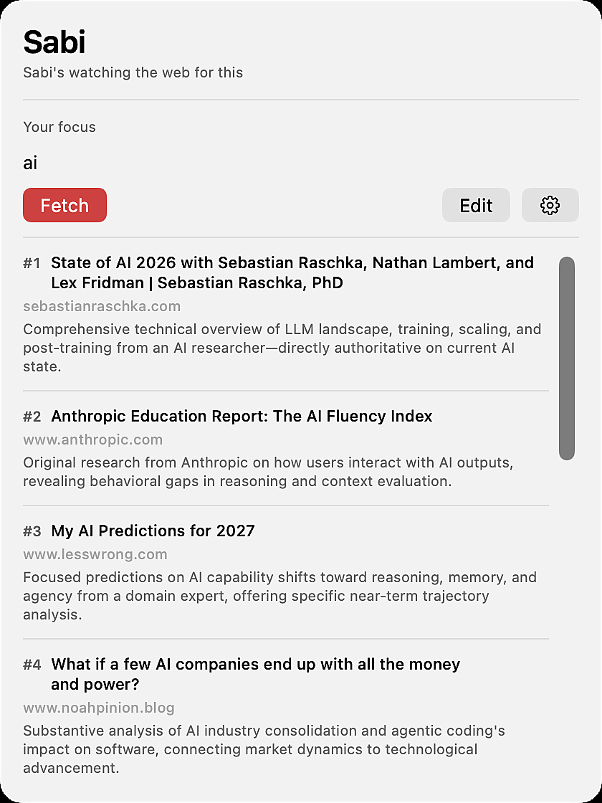
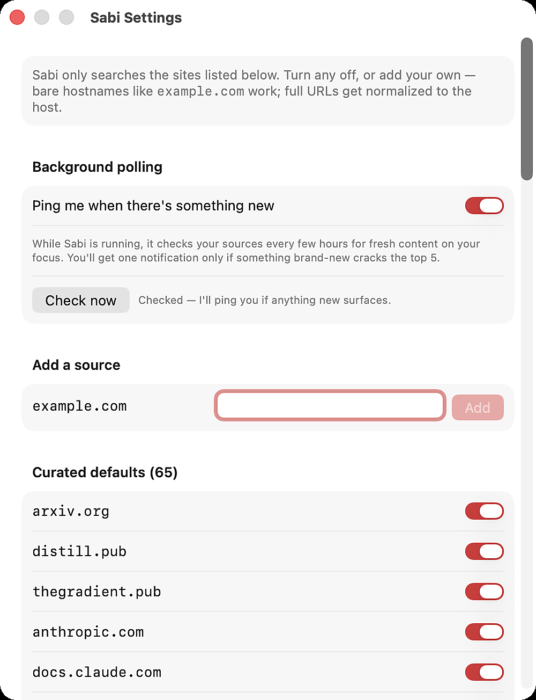
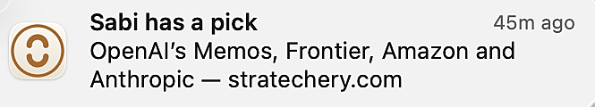

# Sabi

A macOS menu bar app that quietly watches the web for what you're learning — and pings you when something new is worth reading.

Built for the **OpenAI × Handshake Codex Creator Challenge** (April 17–30, 2026).

> Landing page · [sabi.netlify.app](https://sabi.netlify.app) *(live after contest deploy)*
> Demo video · [website/sabi-demo.mp4](website/sabi-demo.mp4)

## What Sabi does

You type what you're currently learning — vague is fine, like "AI" or "black holes" or "industrial policy" — and Sabi:

1. Refines your seed into a specific learning focus (Claude Haiku).
2. Searches a curated allowlist of ~60 high-signal sources (Brave Search API, site-restricted).
3. Ranks results against your focus (Haiku again, with host diversification).
4. Every few hours in the background, re-checks for brand-new past-week content and sends a single notification only if something new cracks your top 5.

No algorithmic feed, no social, no ads. Curated sources, low-frequency pings, configurable. Designed for college students in the "know-it-all circles" (arXiv, Distill, LessWrong, Stratechery, dwarkeshpatel.com, Dan Luu, etc.) who don't want another doomscroll but do want to hear when something hits their lane.

## Screenshots

| Menu bar | Popover |
| --- | --- |
|  |  |

| Sources settings | Notification |
| --- | --- |
|  |  |

## Current state

**Feature-complete MVP.** Every vertical slice from seed-to-notification is shipped, plus polish:

- **Slice 1** — Menu bar app + SwiftUI popover (`MenuBarExtra`).
- **Slice 2** — Anthropic Messages API round-trip + intent persistence.
- **Slice 2b** — Haiku-powered seed augmentation with character-budgeted prompt (≤ 160 chars to stay inside Brave's 400-char query limit).
- **Slice 3** — Brave Search retrieval filtered by a curated domain allowlist.
- **Slice 4** — Haiku re-ranker + macOS `UNUserNotificationCenter` banners.
- **Slice 5** — Minimum lovable copy pass, freshness signals, article-shape filter, dynamic char-budget batching (auto-sizes site clauses against actual intent length).
- **Slice 6** — User-editable sources. Add, disable, delete, clear-all. Persisted to UserDefaults under versioned keys.
- **Slice 7** — `NSBackgroundActivityScheduler` polling every ~4h with a seen-URL log so you never get pinged twice about the same thing.
- **Polish** — First-run welcome card, red-dot menu-bar indicator when a background ping is unread, curated-source hard-delete with reset, and a manual "Check now" button in settings.

## How it works

```
your seed (vague)
  │
  │  AugmentPrompt + Haiku
  ▼
specific learning focus
  │
  │  Retrieval (Brave + allowlist + freshness filter + article-shape filter)
  ▼
candidate articles
  │
  │  Ranker + Haiku (with host diversification)
  ▼
top results, best-first
  │
  ├──> Manual Fetch: shown in the popover, marked as "seen"
  └──> Background poll every ~4h: past-week only, notifies on first unseen top-5 hit
```

## Try it yourself

**Requirements:** macOS 14+ and Xcode 16+.

```bash
git clone https://github.com/olsen-chainwork/sabi.git
cd sabi

# 1. Copy the secrets template and fill in your real API keys.
cp Sabi/Sabi/Secrets.template.swift.example Sabi/Sabi/Secrets.swift

# 2. Open the project in Xcode.
open Sabi/Sabi.xcodeproj
```

Edit the two `REPLACE_ME` strings in `Sabi/Sabi/Secrets.swift`:

- **Anthropic key** — [console.anthropic.com](https://console.anthropic.com) → Settings → API Keys
- **Brave Search key** — [api-dashboard.search.brave.com](https://api-dashboard.search.brave.com) → API Keys (free tier works)

Build and run with `⌘R`. The Sabi icon shows up in your menu bar — click it, type what you're curious about, hit **Fetch**.

> **Safety note:** `Secrets.swift` is gitignored (see `.gitignore`). `Secrets.template.swift.example` is safe to commit — it only holds placeholders. Never paste real keys into the template.

## Tech stack

- **Swift 6 + SwiftUI** with `SWIFT_DEFAULT_ACTOR_ISOLATION = MainActor` — everything's main-actor by default; `nonisolated` is opt-in for things that need it (API clients, pure data types).
- **`MenuBarExtra`** scene for the popover; **`Settings`** scene for the sources editor; Cmd+, opens settings from anywhere in the app.
- **`@Observable`** singletons for state (intent, sources, polling prefs, seen log, ping state) persisted to UserDefaults under versioned keys (`v1`) so migrations are possible.
- **`NSBackgroundActivityScheduler`** for polling — respects battery, thermal state, and power source.
- **Anthropic Claude Haiku 4.5** for both augmentation and ranking. **Brave Search Web API** for retrieval.

Actual runtime: ~$5–$10/mo at real usage — Haiku calls are cheap and Brave's free tier covers retrieval. (Original $40.56 budget was the credit pool, not the spend; see [DESIGN-DOC.md](DESIGN-DOC.md).)

## Project artifacts

- [DESIGN-DOC.md](DESIGN-DOC.md) — locked decisions, constraints, tech stack, scope, success scene
- [STRUCTURE.md](STRUCTURE.md) — high-level phases
- [SLICES.md](SLICES.md) — vertical slice plan
- [BUILD-NOTES.md](BUILD-NOTES.md) — per-slice build diary
- [research.md](research.md) — CRISPE Phase 2 landscape research

## What's next

- Pitch video for contest submission
- Keychain migration for API keys (currently source-embedded via `Secrets.swift`)
- Extract `SabiCore` Swift package and add a `sabi` CLI target with a Homebrew tap (post-contest)

## Status

```
Slices shipped:  7 / 7 + polish
Runtime:         working end-to-end on macOS 14+
Landing page:    ready for Netlify deploy
```
